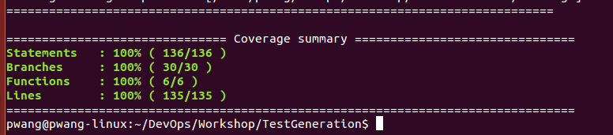

#### Code Result 




## Test Generation

The goal of this work shop is to learn use a combination of mocking, random testing, and feedback-directed testing to automatically increase testing coverage. This is a powerful technique that can automatically discover bugs in new commits deployed to a build server before hitting production or affecting canary servers.

## Setup and Background

    git clone https://github.com/CSC-DevOps/TestGeneration.git
    cd TestGeneration
    npm install

### Code Coverage

Code coverage can be an effective way to measure how well tested a code system is. To see code coverage in action, we will run `istanbul` on our "test suite", represented by 'test.js'.

##### Getting a simple coverage report

[Useful resource](http://ariya.ofilabs.com/2012/12/javascript-code-coverage-with-istanbul.html) for istanbul.

You can run the local version as follows:

    node_modules/.bin/istanbul cover test.js
    node_modules\.bin\istanbul cover test.js (Windows)

To install istanbul globally, saving some keystrokes, you can do the following:

    npm install istanbul -G

You'll get a high level report as follows (a more detailed report will be stored in `coverage/`):

```
=============================== Coverage summary ===============================

Statements   : 80% ( 4/5 )
Branches     : 50% ( 1/2 )
Functions    : 100% ( 1/1 )
Lines        : 100% ( 4/4 )
================================================================================
```

##### See a fully annotated html report here:
    
    open coverage/lcov-report/TestGeneration/subject.js.html
    start coverage/lcov-report/TestGeneration/subject.js.html (Windows)

### Mocking

Testing file system code in unit tests can be challenging. One helpful tool is to use mocking.

The [mock-fs framework](https://github.com/tschaub/mock-fs) can be used to generate a fake file system to help improve coverage.

For example, this is a fake filesystem you can create:

```javascript
mock({
  'path/to/fake/dir': {
    'some-file.txt': 'file content here',
    'empty-dir': {/** empty directory */}
  },
  'path/to/some.png': new Buffer([8, 6, 7, 5, 3, 0, 9]),
  'some/other/path': {/** another empty directory */}
});
```

For example, the following is automatically generated to create to test the function, `fileTest`.

```javascript
mock({"path/fileExists":{},"pathContent":{"file1":"text content"}});
	subject.fileTest('path/fileExists','pathContent/file1');
mock.restore();
```

